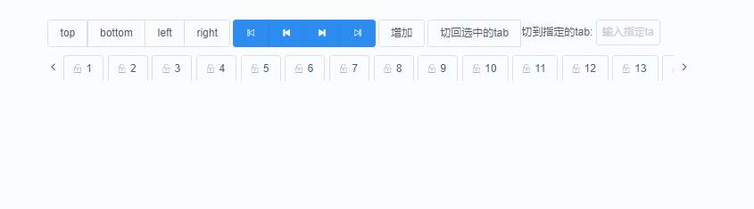

# vue-tab-component

[](https://www.npmjs.com/package/vue-tab-component)[](https://www.npmjs.com/package/vue-tab-component)[](https://opensource.org/licenses/MIT)

> A Vue2.0 tab component which can control DOM render number

**Feature**

- **Custom** DOM render number
- provide **goBegin/goEnd** Function
- suppord **left、right** Position
- suppord **slot** to change tab content

**[EN](README.md)** || **如果它对你有帮助的话，请Star支持！！！**
**[exemple project](https://github.com/qq240814476/vue-tab-component-demo)**

### 预览

------



### 快速开始

------

**Install**

`npm install vue-tab-component --save`

**Usage**

[A simple project use vue-tab-component](https://github.com/qq240814476/vue-tab-component-demo)

main.js

```vue
import Vue from 'vue'
import tabs from 'vue-tab-component'

Vue.use(tabs)
```

### API

---

**Attribute**

| Name             | Description                                           | Type     | Default       |
| :--------------- | :---------------------------------------------------- | :------- | :------------ |
| data             | data of tab    {key:'key',title:'word'}               | Array    | []            |
| tabPosition      | tab' position, one of ['top','bottom','left','right'] | String   | bottom        |
| type             | css type, one of ['card','line']                      | String   | line          |
| closable         | if tab can delete                                     | Boolean  | false         |
| activeName       | active tab's key                                      | String   | ''            |
| maxnum           | max number of DOM render tab at once                  | Number   | 20            |
| beforeChangeTab  | param: key, tab won't change when return false        | Function | (key) => true |
| stretch （todo） | if tab stretchable because of content                 | Boolean  | false         |

**Method**

| Name              | Description         | Param |
| ----------------- | ------------------- | ----- |
| goBegin           | jump to tab's begin | -     |
| goEnd             | jump to tab's end   | -     |
| scrollPrev        | slip to after part  | -     |
| scrollNext        | slip to next part   | -     |
| scrollToActiveTab | slip to active tab  | -     |

**Event**

| Name          | Description                            | Param         |
| ------------- | -------------------------------------- | ------------- |
| on-click      | when tab on clicking, return tab's key | key tab's key |
| on-tab-remove | when tab on deleting, return tab's key | key tab's key |

**slot**

| name | data       | exemple                                                                   |
| ---- | ---------- | ------------------------------------------------------------------------- |
| tab  | tab's data | <template #tab="{ data }"><Icon :type="data.icon"></Icon></template> |


**License**

------

[The 996ICU License (996ICU)](LICENSE)
